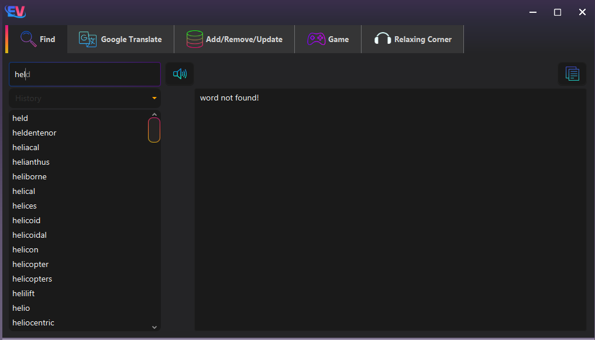
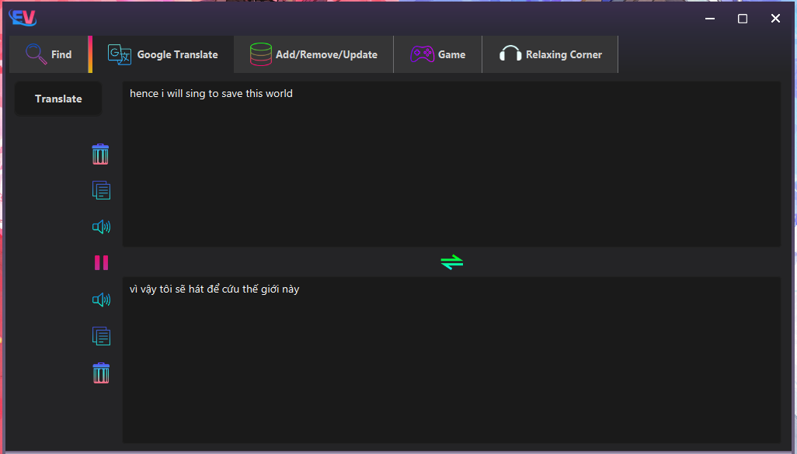
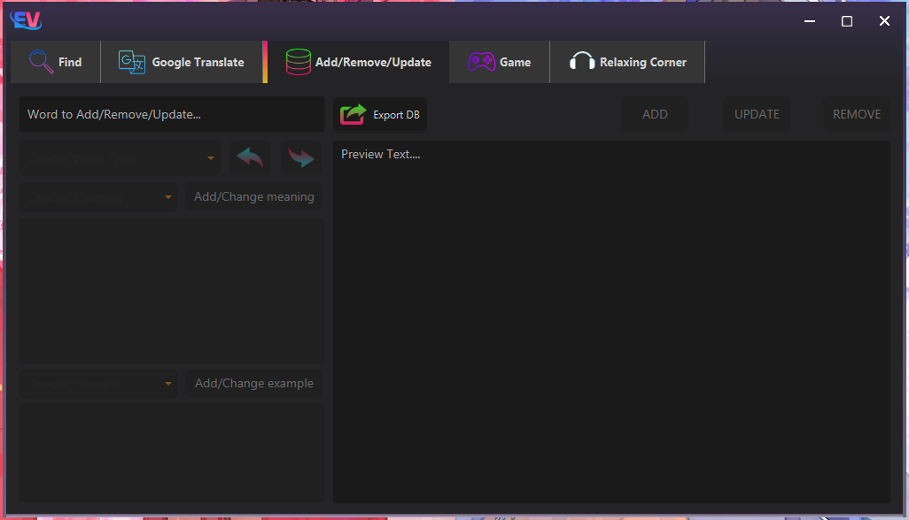
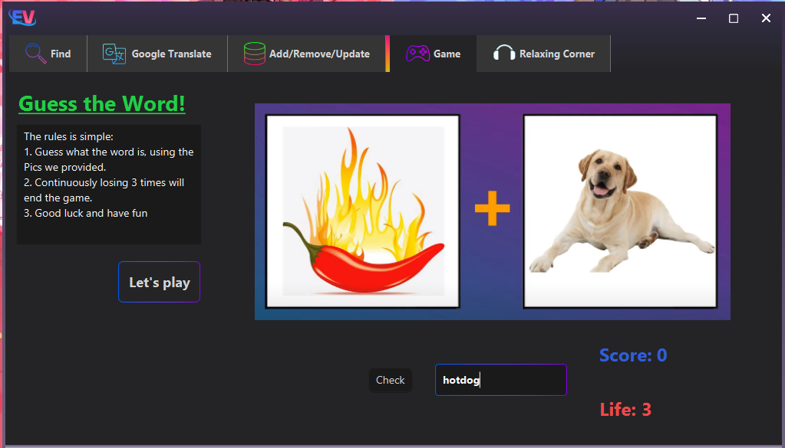

# 📖 EN-VI Dictionary - OOP Project  

**UET OASIS - INT2204 23 - N1**  
*Object-Oriented Programming Course Project*  

---

## 🌟 Features  
A bilingual English-Vietnamese dictionary with:  
- **Word Lookup**  
- **Google Translate Integration**  
- **Custom Dictionary Management** (Add/Edit/Remove words)  
- **Interactive Word Guessing Game**  

   
*Fig 1. Library selection (Built-in dictionary or external file)*  

---

## 🖥️ Screenshots  

### 🔍 Word Search  
    
*Real-time search with "held" example and error handling*  

### 🌐 Translation  
   
*English-Vietnamese translation using Google Translate API*  

### ✏️ Dictionary Management  
   
*Add/update/remove words with examples and meanings*  

### 🎮 Word Guessing Game  
   
*Interactive game with lives system and scoring*  

---

## ⚙️ Technical Stack  
- **Programming Language**: Java  
- **External APIs**: Google Translate  

---

## 🚀 How to Run  
1. Clone the repository  
2. Compile with Java 11+:  
   ```bash 
   javac Main.java
   ```
3. Execute:  
   ```bash
   java Main
   ```
