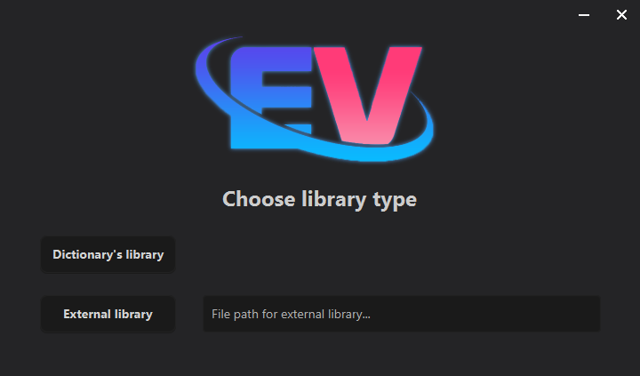
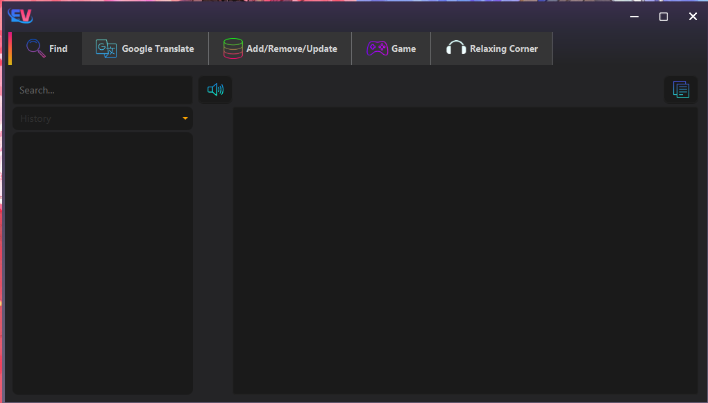

# 📖 EN-VI Dictionary - OOP Project  

**UET OASIS - INT2204 23 - N1**  
*Object-Oriented Programming Course Project*  

---

## 🌟 Features  
A bilingual English-Vietnamese dictionary with:  
- **Word Lookup**  
- **Google Translate Integration**  
- **Custom Dictionary Management** (Add/Edit/Remove words)  
- **Interactive Word Guessing Game**  

![png]
*Fig 1. Library selection (Built-in dictionary or external file)*  

---

## 🖥️ Screenshots  

### 🔍 Word Search  
  
*Real-time search with "held" example and error handling*  

### 🌐 Translation  
  
*English-Vietnamese translation using Google Translate API*  

### ✏️ Dictionary Management  
  
*Add/update/remove words with examples and meanings*  

### 🎮 Word Guessing Game  
  
*Interactive game with lives system and scoring*  

---

## ⚙️ Technical Stack  
- **Programming Language**: Java  
- **OOP Principles**:  
  - Encapsulation (Dictionary class)  
  - Inheritance (Game modes)  
  - Polymorphism (Translation services)  
- **External APIs**: Google Translate  

---

## 🚀 How to Run  
1. Clone the repository  
2. Compile with Java 11+:  
   ```bash 
   javac Main.java
   ```
3. Execute:  
   ```bash
   java Main
   ```

---

## 📂 Project Structure  
```
/src
  ├── DictionaryCore       # Word data handling
  ├── GameEngine          # Word guessing logic  
  ├── TranslationService  # Google Translate API
  /resources
     ├── dictionary.db    # Default word database
```

---

## 👥 Contributors  
| Name | Student ID | Contribution |  
|------|------------|--------------|  
| Your Name | YourID | Core features |  

---

## 📜 License  
MIT License - See [LICENSE](LICENSE)  

---

**🔍 Explore more in the [Wiki](wiki-link)!**  
*For external dictionary files, use `.txt` format with `word|meaning|example` per line.*  

  
*Main menu with all features*  

--- 
🎯 **Upcoming**: Voice pronunciation & user accounts!  

*Last updated: May 2025*  

---

### Why this README works:  
✅ **Visual-first** with annotated screenshots  
✅ **Feature highlights** in emoji bullet points  
✅ **Clear navigation** with section anchors  
✅ **Academic compliance** (course details upfront)  
✅ **Future roadmap** to show project evolution  

Need any adjustments? 😊
